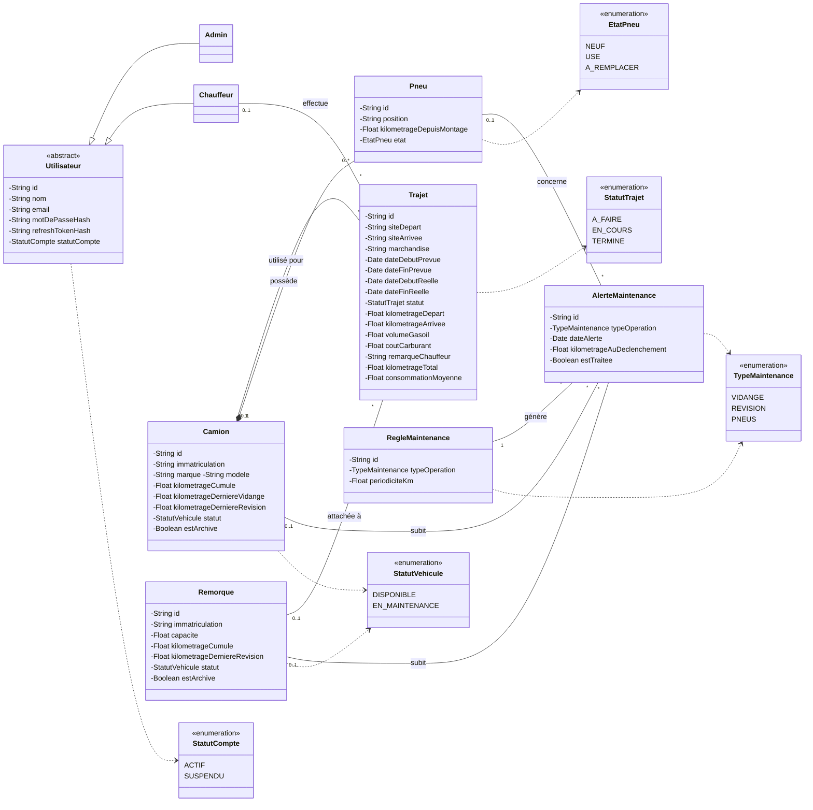

```mermaid
classDiagram
direction LR

class Utilisateur {
  <<abstract>>
  -String id
  -String nom
  -String email
  -String motDePasseHash
  -String refreshTokenHash
  -StatutCompte statutCompte
}
class Admin
class Chauffeur
Utilisateur <|-- Admin
Utilisateur <|-- Chauffeur

class Camion {
  -String id
  -String immatriculation
  -String marque  -String modele
  -Float kilometrageCumule
  -Float kilometrageDerniereVidange
  -Float kilometrageDerniereRevision
  -StatutVehicule statut
  -Boolean estArchive
}

class Remorque {
  -String id
  -String immatriculation
  -Float capacite
  -Float kilometrageCumule
  -Float kilometrageDerniereRevision
  -StatutVehicule statut
  -Boolean estArchive
}

class Pneu {
  -String id
  -String position
  -Float kilometrageDepuisMontage
  -EtatPneu etat
}

class Trajet {
  -String id
  -String siteDepart
  -String siteArrivee
  -String marchandise
  -Date dateDebutPrevue
  -Date dateFinPrevue
  -Date dateDebutReelle
  -Date dateFinReelle
  -StatutTrajet statut
  -Float kilometrageDepart
  -Float kilometrageArrivee
  -Float volumeGasoil
  -Float coutCarburant
  -String remarqueChauffeur
  -Float kilometrageTotal
  -Float consommationMoyenne
}

class RegleMaintenance {
  -String id
  -TypeMaintenance typeOperation
  -Float periodiciteKm
}

class AlerteMaintenance {
  -String id
  -TypeMaintenance typeOperation
  -Date dateAlerte
  -Float kilometrageAuDeclenchement
  -Boolean estTraitee
}

class StatutCompte {
  <<enumeration>>
  ACTIF
  SUSPENDU
}
class StatutVehicule {
  <<enumeration>>
  DISPONIBLE
  EN_MAINTENANCE
}
class StatutTrajet {
  <<enumeration>>
  A_FAIRE
  EN_COURS
  TERMINE
}
class TypeMaintenance {
  <<enumeration>>
  VIDANGE
  REVISION
  PNEUS
}
class EtatPneu {
  <<enumeration>>
  NEUF
  USE
  A_REMPLACER
}

Chauffeur "0..1" -- "*" Trajet : effectue
Camion "0..1" -- "*" Trajet : utilisé pour
Remorque "0..1" -- "*" Trajet : attachée à

Camion "1" *-- "0..*" Pneu : possède

Camion "0..1" -- "*" AlerteMaintenance : subit
Remorque "0..1" -- "*" AlerteMaintenance : subit
Pneu "0..1" -- "*" AlerteMaintenance : concerne

RegleMaintenance "1" -- "*" AlerteMaintenance : génère

Utilisateur ..> StatutCompte
Camion ..> StatutVehicule
Remorque ..> StatutVehicule
Trajet ..> StatutTrajet
Pneu ..> EtatPneu
RegleMaintenance ..> TypeMaintenance
AlerteMaintenance ..> TypeMaintenance
```